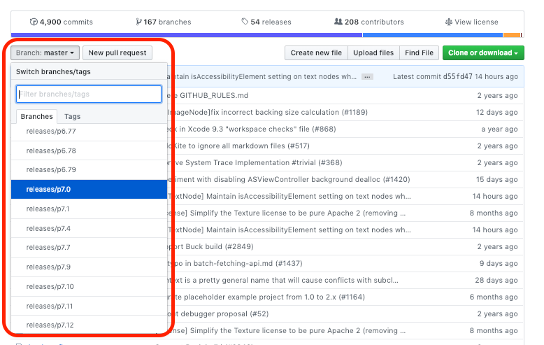

# 민간요법

## Intro

AsyncDisplayKit 출시 이후 Pinterest로 메인테이너가 넘어가면서 Texture로 명칭바뀌고 현재까지 지속적으로 업데이트 되고 있습니다. 오픈소스이고 대부분 Pinterest 및 주요 메인테이너분들도 사람이다 보니 실수하기 마련입니다. 

항상 수시로 올라오는 PR과 Issue처리 상황에 대해서 놓치다보면 Texture Core에 대한 이해도 부족 기존 나쁜 습관으로 인해서 많은 오류를 범하기도 합니다. 

따라서 [Texture Community Slack](http://texturegroup.org/slack.html)에서 주로 질문들어오거나 [Issue](https://github.com/TextureGroup/Texture/issues)에서 반복되는 내용에 대해서 민간요법을 제시하고자 합니다. 

## Too much Warning! \(CocoaPods\)

Texture에는 PINCache, PINRemoteImage 와 같은 생각보다 [많은 dependency](https://github.com/TextureGroup/Texture/blob/master/Texture.podspec)를 가지고 있습니다. dependency 마다 objective-c base고 매번 변경되는 스펙에 따라 warning를 처리를 자주 못해주다 보니 warning이 제법 많이 나타납니다. 

이럴 땐 `inhibit_all_warnings!` 을 Podfile에 적어주면 됩니다.

```bash
inhibit_all_warnings!

pod 'Texture'
```

## 2주 간격으로 배포되는 pX.XX Branch 활용하는 

대표적인 사례로 Texture 2.7 출시 당시 많은 Texture 사용하는 유저들이 경험한 이슈로 32-bit simulator build가 되지 않는 현상으로 인해 pod lib를 배포할 수도 없고 CI에 문제가 생기는 문제가 있었습니다. 




메인테이너 분들은 이러한 부분에 대해서 상시 인지하고 해결하고 있지만 Hot-Fix 배포에 대해서는 망설이는 편입니다. 

이런 상황에서 여러분이 선택 할 수있는 방안은 크게 3가지로 나눠집니다.

* fork해서 처리해서 사용한다.
* Downgrade한다. \(이전 사용버젼으로 rollback\)
* 2주 간격으로 배포되는 pX.XX Branch를 사용한다.

첫번째 대안인 fork해서 처리하는건 사실상 상당히 고통스럽습니다. \(이하 자세한 내용은 생략하겠습니다.\)

두번째 대안은 downgrade하는 것인데 이는 최신 major에서 제공해주는 기능의 선택에 따라서 신중하게 판해야합니다. 

위의 두가지 대안은 상황이나 마주친 버그 스케일에 따라서 상당히 짜증나는 일이 될 수도 있습니다. 

따라서, 가장 권장해 드리고 싶은 방법은 **2주 간격으로 배포되는 pX.XX Branch를 사용을 제안합니다.** 



github diff을 활용하여 원하시는 `pX.XX branch`를 적절히 선택하여 아래와 같이 사용할 수 있습니다.

물론 버그이슈로 인한 pX.XX branch 사용 뿐만 아니라 매번 올라오고 merge되는 **신규 feature**에 대해서도 해당 branch를 통해 사용하실 수가 있습니다. 

#### CocoaPods

```bash
// Podfile

pod 'Texture', :git => 'https://github.com/TextureGroup/Texture.git', :branch => 'p7.0'
```

#### Carthage

```bash
github "texturegroup/texture" "p7.0"
```

## UI가 간헐적으로 일부가 잘려서 나와요. 

이런상황이 발생할 수 있는 가장 큰 요인은 **잘못된 setNeedsLayout** 호출입니다. 

가장 이상적인 `setNeedsLayout` 호출가능한 시점은 **measure layout** 또는 **node loaded 이후** 시점이며 비동기 로직으로 인해  measure layout ****또는 node loaded 이전에 동작하여 불가피하게 `setNeedsLayout` 호출해야되는 상황이 발생한다면 아래의 코드와 같이 처리하는 방법이 있습니다. 

```swift
if self.isNodeLoaded {
    self.setNeedsLayout()
} else {
    self.layoutIfNeeded()
    self.invalidateCalculatedLayout()
}
```

## Texture 2.8에서 ASVideoNode를 사용할 수가 없어요. \(Compile Error\)

GCC\_PREPROCESSOR 이슈로 Texture 2.8 부터 ASVideoNode를 사용하기 위해선 AS\_USE\_VIDEO를 GCC\_PREPROCESSOR\_DEFINITIONS 에서 선언 해주셔야합니다. `AS_USE_VIDEO = 1`



```text
//
//  ASVideoNode.mm
//  Texture
//
//  Copyright (c) Facebook, Inc. and its affiliates.  All rights reserved.
//  Changes after 4/13/2017 are: Copyright (c) Pinterest, Inc.  All rights reserved.
//  Licensed under Apache 2.0: http://www.apache.org/licenses/LICENSE-2.0
//

#import <AsyncDisplayKit/ASVideoNode.h>

#if AS_USE_VIDEO // <----- HERE!

#import <AVFoundation/AVFoundation.h>
#import <AsyncDisplayKit/ASDisplayNode+FrameworkPrivate.h>
#import <AsyncDisplayKit/ASDisplayNode+Subclasses.h>
#import <AsyncDisplayKit/ASDisplayNodeInternal.h>
#import <AsyncDisplayKit/ASEqualityHelpers.h>
```

