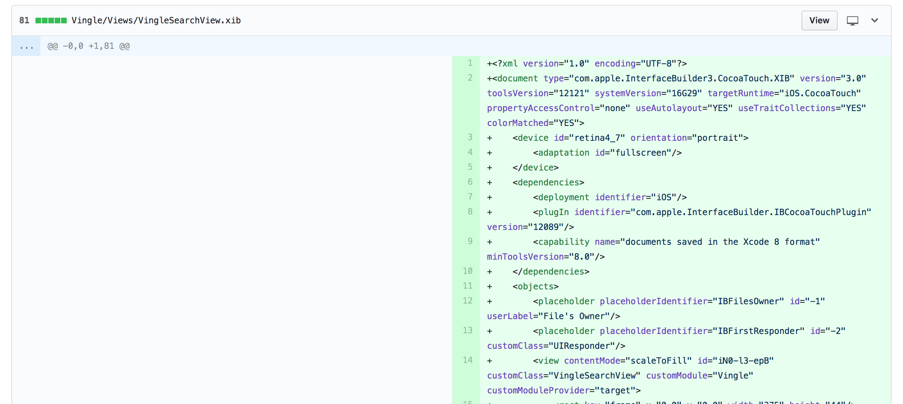
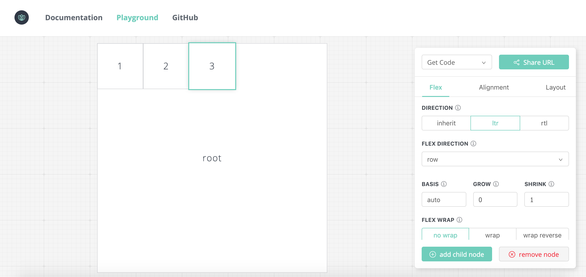

# LayoutSpec?

## Texture Layout API와 Auto-Layout 및 Xib, Storyboard비교

[앞서 소개글](https://texture-kr.gitbook.io/wiki/#motivation-and-benefit)에서 말했듯이 Texture Layout API를 이용하여 코드로 작성하며 Auto-Layout 보다 레이아웃을 설계하는데 있어서 빠릅니다.

풀어 말하자면 Layout을 설계하는 데 Fast & Declarative 가 보장되기 때문에 체계적이고 명료하게 Layout을 설계할 수 있어 생산성 높여준다는 의미입니다.

어떤 의미에서 생산성을 높여주는지는 코드를 비교해봅시다.


예를 들어 위와 같은 UI만든다고 가정하면 코드는 다음과 같습니다.

#### Autolayout을 코드로 작성해서 설계했을 경우

```swift
class RepositoryView: UIView {

    let profileView = UIImageView()
    let usernameLabel = UILabel()
    let descLabel = UILabel()

    // ... 생략 ...

    func makeRepositoryConstraints() {
        usernameLabel.topAnchor.constraint(equalTo: self.topAnchor, constant: ...)
        usernameLabel.bottomAnchor.constraint(equalTo: ..., constant: ...)
        usernameLabel.leadingAnchor.constraint(equalTo: ..., constant: ...)
        usernameLabel.trailingAnchor.constraint(equalTo: ..., constant: ...)

        descLabel.topAnchor.constraint(equalTo: ..., constant: ...)
        descLabel.bottomAnchor.constraint(equalTo: ..., constant: ...)
        descLabel.leadingAnchor.constraint(equalTo: ..., constant: ...)
        descLabel.trailingAnchor.constraint(equalTo: ..., constant: ...)

        // 생략.
    }

    func snapKitBaseMakeRepositoryConstraints() {
        profileView.snp.makeConstraints({
            $0.top.bottom.leading.equalToSuperview().inset(5.0)
            $0.trailing.equalTo(usernameLabel.snp.leading).inset(5.0)
            $0.trailing.equalTo(descLabel.snp.leading).inset(5.0)
        })
        usernameLabel.snp.makeConstraints({

            // 생략.
        })
        descLabel.snp.makeConstraints({

            // 생략.
        })
    }
}
```

#### Texture Layout API를 이용하여 설계 했을 경우

```swift
class RepositoryNode: ASDisplayNode {

   let profileNode = ASNetworkImageNode()
   let usernameNode = ASTextNode()
   let descNode = ASTextNode()

   // ... 생략 ...

   func repositoryLayoutSpec() -> ASLayoutSpec {
       let infoLayout =
       ASStackLayoutSpec(direction: .vertical,
                          spacing: 5.0,
                          justifyContent: .start,
                          alignItems: .stretch,
                          children: [usernameNode, descNode])

       let profileWithInfoLayout = 
       ASStackLayoutSpec(direction: .horizontal,
                         spacing: 5.0,
                         justifyContent: .start,
                         alignItems: .stretch,
                         children: [profileNode, infoLayout])

       return ASInsetLayoutSpec(insets: UIEdgeInsets, child: profileWithInfoLayout)
   }
}
```

사실상 단순한 UI라서 큰차이를 느끼지 못하실껍니다. 하지만, UI의 복잡도가 올라가거나 기존 UI에 새로운 UI 컴포넌트를 추가한다고 가정해봅시다.

**Xib나 Storyboard**의 경우에는 기존 **contraints관계를 파악**한후 constraints를 끊어 낸다던가 추가에 따른 constraints를 추가해야 합니다.

_constraints관계는 top, bottom, left, right, leading, trailing 및 inset, margin값 그리고 constraint priority 등을 의미합니다._

또한 이런 변화요소에 대해서 코드 검증도 받아야하지만 가독성이 좋지는 않습니다.



**Autolayout을 코드**로 작성했을 경우는 Xib 및 Storyboard에 비해 모듈화하기도 쉽고 체계적으로 쓸 수는 있으나 변화요소에 대한 추가작업에 대해서는 여전히 UI 컴포넌트 간의 **constraints관계**를 파악해야합니다.

하지만 **Texture Layout API**의 경우는 다른점이 다양한 **LayoutSpec**이라는 것이 제공됩니다. **선언적이고 명시적인 LayoutSpec**을 사용함으로서 자신 또는 다른 개발자입장에서 봤을 어떠한 형태로 **레이아웃**이 **설계**되었는지 **추론**하기 용이할 뿐더러, 새로운 컴포넌트를 추가하는데 있어서도 **영향을 받는 LayoutSpec에서 코드를 수정**하기면 되기 때문에 contraints관계 파악하는 거보다 상대적으로 빠르고 쉽습니다.


좀 더 이해를 돕기위해서 username과 description아래에 informationLabel을 추가한다고 가정해봅시다.

#### Xib 및 Storyboard의 경우

1. Xib 및 Storyboard 파일을 엽니다. _\(파일을 열고 난후 랜더링하는데 무거워서 사양에 따라서 여는데 시간이 다소 걸립니다.\)_ 
2. constraints관계를 파악합니다.
3. IBOutlet을 연결하고 constraints를 추가합니다. 
4. 코드리뷰 아니 xib 변경사항에 대해서 리뷰를 받습니다. \(방법은 다양합니다. snapshot 또는 동료개발자가 직접열어 본다던가 앱에서 실행해서 검증하는 방법 etc.. \)

#### Autolayout의 경우

1. constraints를 다루는 method를 찾습니다. 
2. 코드상 constraints관계를 파악합니다.
3. constraints추가 및 수정합니다. 
4. 동료로 부터 코드리뷰를 받습니다. \(동료 역시 리뷰시 constraints관계를 파악해야합니다. \) 

```swift
class RepositoryView: UIView {

    let profileView = UIImageView()
    let usernameLabel = UILabel()
    let descLabel = UILabel()

    let informationLabel = UILabel()
    // ... 생략 ...

    func makeRepositoryConstraints() {
        usernameLabel.topAnchor.constraint(equalTo: self.topAnchor, constant: ...)
        usernameLabel.bottomAnchor.constraint(equalTo: ..., constant: ...)
        usernameLabel.leadingAnchor.constraint(equalTo: ..., constant: ...)
        usernameLabel.trailingAnchor.constraint(equalTo: ..., constant: ...)

        descLabel.topAnchor.constraint(equalTo: ..., constant: ...)
        descLabel.bottomAnchor.constraint(equalTo: ..., constant: ...)
        descLabel.leadingAnchor.constraint(equalTo: ..., constant: ...)
        descLabel.trailingAnchor.constraint(equalTo: ..., constant: ...)

        // 1. constraints관계 파악
        // 2. constraints 추가 및 수정  
    }

    func snapKitBaseMakeRepositoryConstraints() {
        profileView.snp.makeConstraints({
            $0.top.bottom.leading.equalToSuperview().inset(5.0)
            $0.trailing.equalTo(usernameLabel.snp.leading).inset(5.0)
            $0.trailing.equalTo(descLabel.snp.leading).inset(5.0)
        })
        usernameLabel.snp.makeConstraints({

            // 생략.
        })
        descLabel.snp.makeConstraints({

            // 생략.
        })

        // 1. constraints관계 파악
        // 2. constraints 추가 및 수
    }
}
```

#### Texture Layout API의 경우

1. 해당 UI의 layoutSpecThatsFit method로 갑니다. 
2. 수정해야하는 LayoutSpec  추적 및 파악합니다.
3. UI Components 추가합니다. 
4. 코드리뷰를 받습니다. 

```swift
class RepositoryNode: ASDisplayNode {

   let profileNode = ASNetworkImageNode()
   let usernameNode = ASTextNode()
   let descNode = ASTextNode()

   let infomationNode = ASTextNode()    
   // ... 생략 ...

   func repositoryLayoutSpec() -> ASLayoutSpec {

       // 1. 수정해야하는 LayoutSpec 추적 및 파악 
       let infoLayout =
       ASStackLayoutSpec(direction: .vertical,
                          spacing: 5.0,
                          justifyContent: .start,
                          alignItems: .stretch,
                          children: [usernameNode, descNode, infomationNode])
        // 2. 컴포넌트 추가,ASStackLayoutSpec -> children -> infomationNode 추가. 

       let profileWithInfoLayout = 
       ASStackLayoutSpec(direction: .horizontal,
                         spacing: 5.0,
                         justifyContent: .start,
                         alignItems: .stretch,
                         children: [profileNode, infoLayout])

       return ASInsetLayoutSpec(insets: UIEdgeInsets, child: profileWithInfoLayout)
   }
}
```

[다양한 LayoutSpec에 대해서 더 알아보기](https://texture-kr.gitbook.io/wiki/layout-api/layoutspecs)

## 퍼포먼스


Texture랑 auto-layout의 퍼포먼스에 대한 수치적으로 비교한 자료는 없습니다.

하지만, Autolayout 에 비해 frame 기반으로 설정된 레이아웃이 퍼포먼스가 우수한건 사실입니다.



Texture가 Auto-Layout으로 설계된 레이아웃보다 랜더링하는데 있어서 퍼포먼스가 빠른 이유는 다음과 같습니다.

* 복잡한 레이아웃 설계를 Main-Thread가 아닌 **Background Thread에서 처리하고 frame을 계산**합니다.
* Auto-Layout을 사용하지않고 Auto-Layout처럼 **Main Thread를 방해하지 않습니다.**
* UICollectionView 및 UITableView의 prefetch 및 reuse cell을 하지 않고 [Intelligent preloading](http://texturegroup.org/docs/intelligent-preloading.html) 및 pending layout 을 사용하여 Reuse cell에서 일어나는 많은 버그와 Frame Drop을 줄임과 동시에 우수한 사용자 경험성을 제공합니다. 
* Image처리 및 Attributed Text Encoding에 있어서 최적화가 잘되어있습니다. 

\_\_

## LayoutSpec 설계시 Tip 및 유의사항

### 1. 명시적으로 LayoutSpec을 설계합니다.


입문자의 경우 layoutSpec을 설계할 때 layoutSpecThatFits에 모든 레이아웃 설계사항을 다 넣는 경우가 있습니다. 협업 및 생산성 향상을 위해서 LayoutSpec 설계사항에 대해서 메서드를 분리하고 명시적으로 선언해주는 것이 좋습니다.

#### 나쁜 예

```swift
ovrride func layoutSpecThatFits(_ constraintedSize: ASSizeRange) -> ASLayoutSpec {

       let infoLayout =
       ASStackLayoutSpec(direction: .vertical,
                          spacing: 5.0,
                          justifyContent: .start,
                          alignItems: .stretch,
                          children: [usernameNode, descNode])

       let profileWithInfoLayout = 
       ASStackLayoutSpec(direction: .horizontal,
                         spacing: 5.0,
                         justifyContent: .start,
                         alignItems: .stretch,
                         children: [profileNode, infoLayout])

       return ASInsetLayoutSpec(insets: UIEdgeInsets, child: profileWithInfoLayout)
}
```

#### 좋은 예

```swift
ovrride func layoutSpecThatFits(_ constraintedSize: ASSizeRange) -> ASLayoutSpec {

       let infoLayout = self.infoAreaLayoutSpec()

       let profileWithInfoLayout = 
       ASStackLayoutSpec(direction: .horizontal,
                         spacing: 5.0,
                         justifyContent: .start,
                         alignItems: .stretch,
                         children: [profileNode, infoLayout])

       return ASInsetLayoutSpec(insets: UIEdgeInsets, child: profileWithInfoLayout)
}

// 분리!, 나중에 info영역에 새로운 컴포넌트가 추가된다면 해당 메서드에 집중할 수 있습니다. 
func infoAreaLayoutSpec() -> ASLayoutSpec {
    return ASStackLayoutSpec(direction: .vertical,
                             spacing: 5.0,
                             justifyContent: .start,
                             alignItems: .stretch,
                             children: [usernameNode, descNode])
}
```

### 2. LayoutSpec 및 Layout Element Properties만 사용해주세요.

Thread에 영향을 주는 요소는 넣지 않는게 좋습니다. \(주된 Crash 요인\)

[Layout Element Properties? ](https://texture-kr.gitbook.io/wiki/layout-api/layout-element-properties)

#### 나쁜 예

```swift
override func layoutSpecThatFits(_ constraintedSize: ASSizeRange) -> ASLayoutSpec {

    DispatchQueue.main.async { ... } // NO!

    let _ = UIScreen.main.bounds // NO!, -> constraintedSize 사용.

    _some_lock.lock() // NO!, 사유: Lock Assertion Crash

    someNode.view // NO! 사유: Main-Thread Assertion
    someNode.layer // NO! 사유: Main-Thread Assertion

    // 오로지 LayoutSpec 및 LayoutElement Properties만 사용합시다. 
}
```

### 3. 가변적인 ASStackLayoutSpec 설계시 children은 ASLayoutElement Array 로 빼내서 관리하기!

```swift
override func layoutSpecThatFits(_ constraintedSize: ASSizeRange) -> ASLayoutSpec {
       let layout = ASStackLayoutSpec(direction: .horizontal,
                                      spacing: 5.0,
                                      justifyContent: .start,
                                      alignItems: .stretch,
                                      children: [node1, node2, ... , node10])
}
```

#### 리펙토링 예

```swift
override func layoutSpecThatFits(_ constraintedSize: ASSizeRange) -> ASLayoutSpec {
       var children: [ASLayoutElement] = [node1, node2]

       if hasNode3 {
           children.append(node3)
       }

       if hasSomeLayout { 
           let layout = ASLayoutSpec(...)
           // ASLayoutSpec -> ASLayoutElement로 형변환됩니다.
           children.append(layout)
       }

       let layout = ASStackLayoutSpec(direction: .horizontal,
                                      spacing: 5.0,
                                      justifyContent: .start,
                                      alignItems: .stretch,
                                      children: children)
}
```

### 4. LayoutSpec 변화를 주고 싶을 땐 setNeedsLayout을 호출합시다.

setNeedsLayout호출시 Texture의 기본 Transition Animation API를 사용하여 필요에 따라 layout을 업데이트 해줍니다.

주의해야할 점은 부모 node가 didLoad 이후에 호출해야합니다. \(isNodLoaded property참고\) didLoad이전 및 init 시점에서 setNeedsLayout호출은 하지 마십시오.

### 5. FlexBox에 서툴어요. ㅠㅠ





Flex값 조절에 서툴다면 Faebook Yoga playground로 연습하실수가 있습니다.

그 이외 도움되는 사이트







### 6. subclass만들지 않고 node에 layoutSpec을 정의하고 싶어요.

Node의 layoutSpec을 설계하는 방법은 크게 두가지가 있습니다.

* subclass를 만들어서 layoutSpecThatFits를 override하는 방법
* layoutSpecBlock을 이용하는 방법

6번 질문과 같은 경우는 후자의 방식을 사용하면 됩니다. 단 block에 spec을 다 넣는 건 가독성을 방해하고 코드의 응집도를 저하시키기 때문에 부모 노드의 클래스에 method를 작성을 권장드립니다.

#### 예시

```swift
class GrandMotherNode: ASDisplayNode {

   let motherNode = ASDisplayNode()
   let childNode = ASDisplayNode()

   init() {
       motherNode.automaticallyManageSubnodes = true
       motherNode.layoutSpecBlock = { [weak self] (node, constraintedSize) -> ASLayoutSpec in 
            return self?.motherLayoutSpec(constraintedSize) ?? ASLayoutSpec()
       }
   }

   func motherLayoutSpec(_ constraintedSize: ASSizeRange) -> ASLayoutSpec {
       return ASInsetLayoutSpec(insets: .zero, child: childNode)
   }

   override func layoutSpecThatFits(_ constraintedSize: ASSizeRange) -> ASLayoutSpec {
      return ASInsetLayoutSpec(insets: .zero, child: motherNode)
   }
}
```

좀 더 자세히 보면 다음과 같습니다.

```swift
// ASM을 사용합니다. (정신건강에 좋습다.)
motherNode.automaticallyManageSubnodes = true

// - retain cycle에 주의합니다. (weak self)
// - 매개변수는 해당 노드(motherNode)와 constrainedSize(ASSizeRange)를 받습니다. 
// - ASLayoutSpec을 리턴합니다. 
motherNode.layoutSpecBlock = { [weak self] (node, constraintedSize) -> ASLayoutSpec in 
    return self?.motherLayoutSpec(constraintedSize) ?? ASLayoutSpec()
}
```

