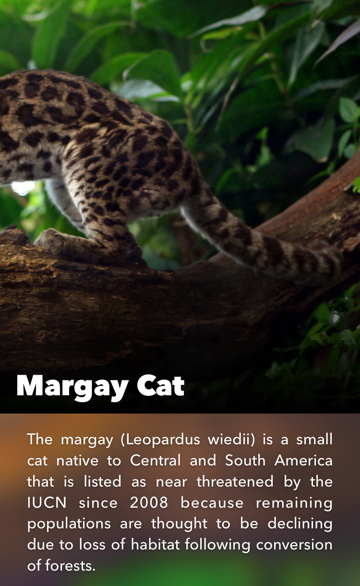
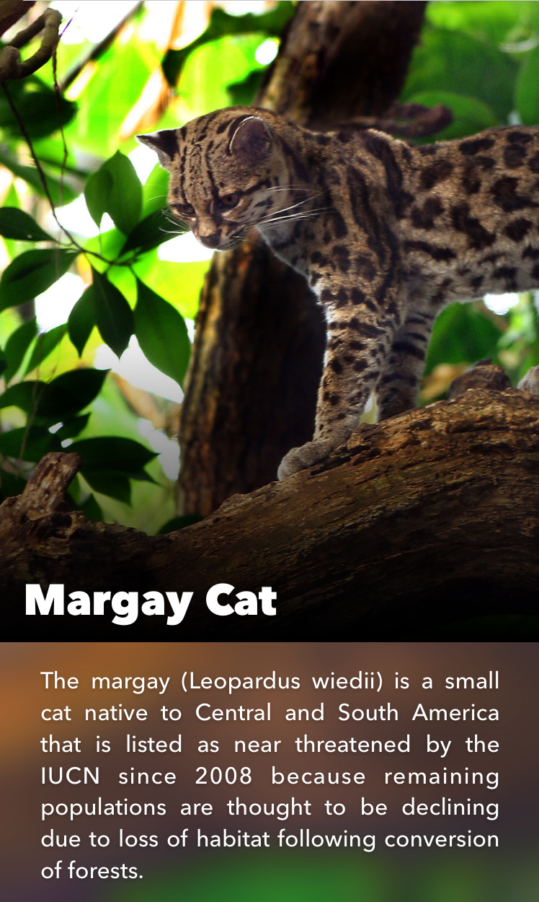
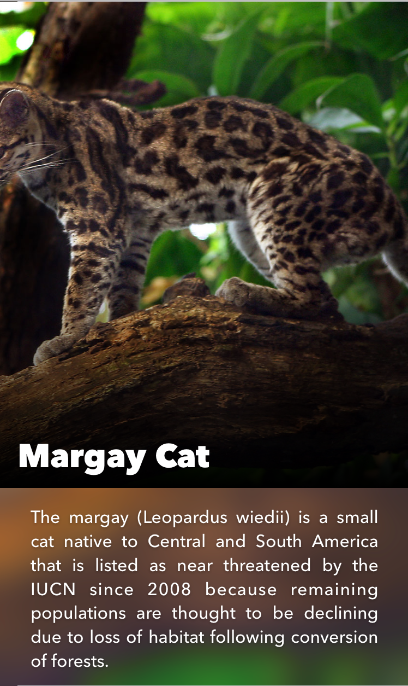

# ASImageNode

`ASImageNode` 는 Texture 의 `UIImageView` 입니다. 가장 기본적인 차이점은 이미지들이 기본적으로 비동기 디코딩 된다는 점입니다. 물론 이것 말고도 GIF 지원이나 `imageModificationBlock` 과 같이 강화된 개선 기능들이 있습니다.

## 기본 사용법

ASImageNode 를 사용하는 것은 UIImageView 를 사용하는 것과 똑같습니다.

```swift
let imageNode = ASImageNode()

imageNode.image = UIImage(named: "someImage")
imageNode.contentMode = .scaleAspectFill
```

## 이미지 변환과 효과

대부분, 보여지고 있는 이미지 모양에 영향을 주는 작업들은 Main Thread 의 큰 리소스를 차지하는 작업이었습니다. 당연히 당신은 이러한 작업들을 Background Thread 로 옮기고 싶을 것입니다.

`imageNode` 에 `imageModificationBlock` 을 할당함으로써, display 를 위한 별도의 call 없이 `imageNode` 의 이미지들에 비동기적으로 일어나야 하는 transformation\(rounding, boder 넣기, 또는 패턴 overlay 등과 같은 이미지 효과\) 의 집합을 정의할 수 있습니다.

이것에 대해 더 알고싶다면, [Image Modification Blocks](http://texturegroup.org/docs/image-modification-block.html) 를 참고하세요.

## 이미지 자르기

`imageNode` 의 `contentMode` 프로퍼티가 `UIViewContentModeScaleAspectFill` 로 되어있다면, 이것은 자동적으로 이미지를 `imageNode` 의 전체 영역을 채우도록 확대시킬 것이고, 이미지의 확대로 인해 bounds 를 벗어나는 부분들은 크롭될 것입니다.

default 로 확대된 이미지는 뷰의 bound 에 중앙 정렬될 것입니다. 아래 보이는 고양이 이미지를 보세요. 그의 얼굴이 default 로 크롭되었습니다.



이상하죠! 이것을 수정하려면, `cropRect` 프로퍼티를 설정해서 이미지를 움직이세요. default 값은 `CGRectMake(0.5, 0.5, 0.0, 0.0)` 입니다.

rectangle 은 소스가 되는 이미지의 가로와 세로값의 백분율을 사용하는 "unit rectangle" 로 되어 있습니다.

이미지를 왼쪽부터 시작하게 하려면, `cropRect`의 x 값을 0.0 으로 설정하세요. 이것은 이미지의 origin 이 default 값과는 반대로 `{0,0}` 으로 시작해야 한다는 것을 의미합니다.

```swift
animalImageNode.cropRect = CGRect(x: 0, y: 0, width: 0.0, height: 0.0)
```

가로와 세로값을 0으로 두는 것의 의미는 이미지가 stretch 되지 않는다는 뜻입니다.



반대로 origin `x` 값을 1.0 으로 두면, 이미지를 오른쪽 정렬할 수 있습니다.



## 강제로 Upscaling 하기

기본적으로 이미지가 너무 작아서 설정된 `imageNode` 의 bounds 에 맞지 않을 때 CPU에서 upscale 되지 않는다.

이 때 `forceUpscaling` 값을 `true` 로 설정할 수 있습니다.   
이것은 타겟 이미지뷰보다 이미지가 작을 때 당신의 앱이 더 많은 메모리를 잡아먹게됨을 의미합니다.

## Image Scaling 을 감지하기

[pixel scaling tool](http://texturegroup.org/docs/debug-tool-pixel-scaling.html) 을 사용하면 당신의 앱이 사용하고 있는 각각의 이미지들이 얼만큼 scale up 또는 down 되었는지 체크할 수 있습니다.

만약 이미지가 너무 크다면, 당신은 과도한 이미지 데이터를 렌더링하는 리스크를 감수해야 하고, 이미지가 너무 작다면 저화질의 이미지를 upscaling 하는 데 시간을 들이게 됩니다.

API를 컨트롤 할 수 있다면, 이런 과정들을 피할 수 있도록 알맞은 스케일의 이미지를 받는 것을 고려해보세요.

